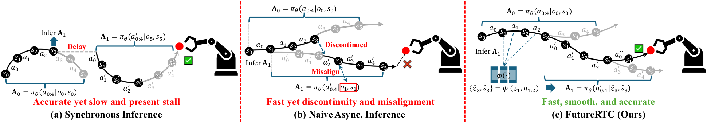

# FutureRTC: Real-Time Robot Execution with Anticipatory-Conditioned Action Chunking
<h4 align="center">Hai Jiang<sup>1</sup>, Yixian Zou<sup>2</sup>, Binbin Liang<sup>1</sup>, Boqian Liu<sup>3</sup>, Fanman Meng<sup>2</sup>, Shuaicheng Liu<sup>2</sup></center>
<h4 align="center">1.Sichuan University,
<h4 align="center">2.University of Electronic Science and Technology of China,</center></center>
<h4 align="center">3.University of Alberta</center></center>
  
<h4 align="center"> <div>
  <p>
    <a href="https://arxiv.org/abs/2607.24008"></a>
    <a href="https://jianghaiscu.github.io/FutureRTC_proj/"></a>
  </p>
  
</div>

---

## Overview
Real-time deployment of Vision-Language-Action (VLA) policies requires **asynchronous execution**:
the next action chunk is computed while the current one is still running. That creates a
**prediction–execution misalignment** — by the time a chunk takes over, the observation it was
computed from is already stale — which shows up as inter-chunk discontinuity. Existing methods
either smooth the chunk boundary superficially, pay for costly policy optimization, or roll the
proprioceptive state forward while ignoring the visual observation entirely.



## Results on LIBERO

Success rate (%) and execution steps, averaged over the four LIBERO suites, at inference delays
`d ∈ {5, 10, 15, 20}`. 

<div align="center">

<table>
<thead>
<tr>
  <th></th><th>Method</th>
  <th colspan="4">π₀.₅ &nbsp;&nbsp; SR (%) ↑ / Steps ↓</th>
  <th colspan="4">SmolVLA-450M &nbsp;&nbsp; SR (%) ↑ / Steps ↓</th>
</tr>
<tr>
  <th></th><th></th>
  <th>d=5</th><th>d=10</th><th>d=15</th><th>d=20</th>
  <th>d=5</th><th>d=10</th><th>d=15</th><th>d=20</th>
</tr>
</thead>
<tbody>
<tr><td rowspan="4"><b>Inference<br>time</b></td>
    <td>Naive Async.</td>
    <td>89.5 / 169.0</td><td>82.7 / 183.0</td><td>76.3 / 196.6</td><td>68.3 / 210.9</td>
    <td>70.3 / 206.4</td><td>64.5 / 218.2</td><td>61.3 / 224.2</td><td>56.2 / 232.8</td></tr>
<tr><td>TE</td>
    <td>87.8 / 173.0</td><td>84.3 / 180.1</td><td>80.6 / 185.8</td><td>74.8 / 197.0</td>
    <td>68.4 / 208.8</td><td>66.7 / 212.9</td><td>62.6 / 220.0</td><td>59.7 / 224.2</td></tr>
<tr><td>BID</td>
    <td>90.3 / 168.2</td><td>84.0 / 180.5</td><td>76.1 / 197.3</td><td>71.3 / 205.8</td>
    <td>70.0 / 207.6</td><td>65.0 / 216.4</td><td>61.7 / 223.0</td><td>57.1 / 229.4</td></tr>
<tr><td>RTC</td>
    <td>89.9 / 168.4</td><td>83.2 / 181.6</td><td>77.5 / 194.2</td><td>73.7 / 200.5</td>
    <td>69.7 / 208.1</td><td>64.9 / 217.0</td><td>62.6 / 220.9</td><td>58.7 / 226.3</td></tr>
<tr><td rowspan="4"><b>Training<br>time</b></td>
    <td>T-RTC</td>
    <td>89.4 / 168.5</td><td>84.0 / 177.7</td><td>77.9 / 193.1</td><td>74.0 / 200.1</td>
    <td>69.9 / 208.7</td><td>65.6 / 215.8</td><td>61.7 / 222.0</td><td>59.4 / 226.6</td></tr>
<tr><td>VLASH</td>
    <td>88.0 / 171.9</td><td>83.4 / 178.9</td><td>79.5 / 187.4</td><td>74.5 / 197.4</td>
    <td>69.3 / 208.5</td><td>65.8 / 217.6</td><td>64.7 / 215.6</td><td>61.9 / 220.9</td></tr>
<tr><td>REMAC</td>
    <td>90.8 / 166.6</td><td>85.4 / 177.6</td><td>78.5 / 192.6</td><td>73.9 / 199.6</td>
    <td>70.9 / 206.2</td><td>66.5 / 213.5</td><td>62.2 / 220.9</td><td>59.7 / 224.9</td></tr>
<tr><td><b>FutureRTC (Ours)</b></td>
    <td><b>94.2 / 162.4</b></td><td><b>92.4 / 166.9</b></td><td><b>91.0 / 170.1</b></td><td><b>88.5 / 175.1</b></td>
    <td><b>75.8 / 198.7</b></td><td><b>73.3 / 202.7</b></td><td><b>71.6 / 206.4</b></td><td><b>69.4 / 209.4</b></td></tr>
</tbody>
</table>

</div>

The paper additionally reports results on the **Kinetix** simulator (12 dynamic environments,
`d ∈ [0, 4]`) and on **real-world bimanual manipulation** with an AgileX Cobot Magic robot
(*Stack Plates*, *Fold Towel*, *Hang Cups*). Those are outside the scope of this release, which
covers the LIBERO pipeline.

---

## Requirements

| Item | Recommendation |
|------|----------------|
| OS | Ubuntu 22.04 |
| GPU | ≥ 24 GB VRAM for evaluation|
| Python | 3.10+ |
| Stack | LeRobot v0.5.1, LIBERO, robosuite, MuJoCo, PyTorch |

---

## Environment Setup

### 1. Python environment

Install the LeRobot v0.5.1 stack together with LIBERO, robosuite and MuJoCo. The launch scripts call
`python3`; point them at another interpreter with `PYTHON=/path/to/python`.

If LeRobot is installed in that environment, nothing else is needed. If you run from a source
checkout instead, set `LEROBOT_ROOT=/path/to/lerobot` (or pass `--lerobot-root`).

### 2. Backbone checkpoint

Either a LIBERO-finetuned **π₀.₅** (plus a PaliGemma tokenizer directory), or a LIBERO
**SmolVLA-450M** checkpoint. The pretrained weight is never modified.

### 3. LIBERO dataset

```bash
huggingface-cli download HuggingFaceVLA/libero --repo-type dataset \
  --revision 86958911c0f959db2bbbdb107eb3e17c5f9c798e \
  --local-dir /path/to/libero
```

That revision is pinned: `assets/libero_action_stats.json` was extracted from its `meta/stats.json`,
and the action normalization must match.

### 4. Paths

Every path comes from an environment variable or a CLI flag — nothing is hardcoded.

| Variable | Description |
|----------|-------------|
| `POLICY_PATH` | Backbone checkpoint directory (π₀.₅ or SmolVLA) |
| `DATASET_ROOT` | Local LeRobot LIBERO dataset root |
| `TOKENIZER_PATH` | External PaliGemma tokenizer (**π₀.₅ only**; SmolVLA ships its own) |
| `BANK_DIR` | Visual-latent bank directory (training) |
| `CORRECTOR_CKPT` | State correction module checkpoint (default `weights/corrector.pt`) |
| `LEROBOT_ROOT` | *Optional.* LeRobot source checkout, when it is not installed |
| `PYTHON` | *Optional.* Interpreter for the launch scripts (default `python3`) |

```bash
export DATASET_ROOT=/path/to/libero
export POLICY_PATH=/path/to/pi05_libero_finetuned
export TOKENIZER_PATH=/path/to/hf_paligemma_tokenizer
```

---

## Training

Steps 1–4 reproduce the shipped checkpoints. To evaluate only, skip to
[Evaluation](#evaluation) — `weights/` already contains their outputs.

### 1. State correction module

Reads only the dataset's state and action columns; no policy, no images.

```bash
launch/train_corrector.sh 0 outputs/corrector/full_state_residual_d0_20.pt
```

`d ~ U{0..20}`, AdamW, batch 512, cosine LR to 0, 100k steps.

### 2. Visual-latent bank

Each demonstration frame is embedded exactly once, at the same boundary the evaluation driver
injects at — so training and deployment see identical latents by construction. Delays are resampled
from this bank at training time, giving full (frame × delay) coverage with no per-pair duplication.

```bash
BANK_DIR=outputs/latent_bank_pi05 OUTPUT_DIR=outputs/latent_bank_pi05 launch/collect_pi05.sh 0 0 1
```

The last two arguments are `worker_id` and `num_workers`: run one process per worker on its own GPU,
all writing to the same `OUTPUT_DIR`, to shard a large bank across cards.

### 3. Sidecar and statistics

```bash
python predictor/collect_state_sidecar.py \
  --dataset-root "$DATASET_ROOT" --dataset-revision 86958911c0f959db2bbbdb107eb3e17c5f9c798e \
  --bank-dir outputs/latent_bank_pi05 \
  --output outputs/latent_bank_pi05/state_task_sidecar.pt

python predictor/compute_latent_stats.py --bank-dir outputs/latent_bank_pi05
```

### 4. Observation prediction module — two phases

| Phase | Loss | π₀.₅ | SmolVLA |
|---|---|---|---|
| 1 — reconstruction | `mse 1.0` | lr 1e-4, batch 64 | lr 3e-4, batch 256 |
| 2 — policy consistency | `+ policy 10.0`, resumed from phase 1 | lr 1e-4, batch 16 | lr 1e-4, batch 32 |

Both anneal the learning rate on a cosine schedule to `1e-6` and sample `d ~ U{1..20}`.

```bash
BANK_DIR=outputs/latent_bank_pi05 launch/train_predictor_phase1_pi05.sh 0

BANK_DIR=outputs/latent_bank_pi05 \
  launch/train_predictor_phase2_pl_pi05.sh 0 outputs/predictor_pi05_phase1/predictor.pt
```

The cosine (feature) term is optional: set `FEATURE_WEIGHT=0` on phase 1 to train on MSE alone.

---

## Evaluation

All requested delays run **concurrently** in one asynchronous vector-env batch
(`n_envs = b_t × n_delays`), so a whole delay sweep costs one pass of environment stepping on one
GPU rather than one pass per delay.

```bash
launch/eval_pi05.sh 0 weights/predictor_pi05.pt outputs/eval_pi05
python eval/aggregate.py outputs/eval_pi05
```

Defaults: replan stride `s = 25`, delays `5,10,15,20`, 10 tasks per suite, 50 episodes per task,
seed 7, and the four suites in sequence with step caps `libero_spatial` 220, `libero_object` 280,
`libero_goal` 300, `libero_10` 520.

Override any of them by environment variable:

```bash
DELAYS=5 TASK_IDS=0 NUM_TRIALS=2 CPU_FRACTION=0.05 \
  launch/eval_pi05.sh 0 weights/predictor_pi05.pt outputs/smoke libero_spatial:220
```

---

### Pretrained weights

| File | Backbone | Parameters ||
|---|---|---|---|
| `weights/predictor_pi05.pt` | π₀.₅ | 6,407,061 ||
| `weights/predictor_smolvla.pt` | SmolVLA-450M | 5,146,069 ||
| `weights/corrector.pt` | — | 40,328 | |

---

## Tests

```bash
python -m unittest discover -s tests -t . -p 'test_*.py' -v
```

The `-s tests -t .` form matters: some environments ship a `tests` package that shadows a bare
`python -m unittest tests.foo`. These cover the evaluation path — the handoff schedule, the driver's
observation slicing and action assembly, the per-episode metrics, and result aggregation.

---

## Troubleshooting

| Issue | Fix |
|-------|-----|
| Two concurrent runs corrupt each other's compiled kernels | Give each run its own `TMPDIR`, `TORCHINDUCTOR_CACHE_DIR` and `TRITON_CACHE_DIR`. The launch scripts already do this per output directory. |
| robosuite asserts on `MUJOCO_EGL_DEVICE_ID` at import | Set it to the **physical** GPU id before launching; `common.runtime.normalize_single_visible_egl_device` imports robosuite and only then rewrites it to the in-process id `0`. Do not reorder those steps. |
| DataLoader workers die at step 0 | Use a **short** `TMPDIR`: worker startup opens a unix socket whose path is capped near 108 characters, and a long scratch path overflows it. |
| CUDA OOM while collecting the latent bank | Lower `--batch-size`. Latent capture already runs under `no_grad`; without it π₀.₅'s vision tower would exhaust a 24 GB card on its own. |
| Environment count does not divide the trial count | `n_envs = b_t × n_delays`, with `b_t` derived from `--cpu-fraction` and the host core count. Pick a fraction that makes `b_t` divide the per-task trial count — with 4 delays and 50 trials on a 128-core host, `0.32` gives `b_t = 10`. |
| `ModuleNotFoundError: lerobot` | Install LeRobot in the environment, or set `LEROBOT_ROOT` / pass `--lerobot-root` to a checkout containing `src/`. |

**Three action spaces, never interchangeable.** BANK (`qnorm(env)`) is what the latent bank stores
and what the motion prior consumes; ENV (physical OSC deltas) is what the state correction module
forward-integrates; POLICY (`(env − mean)/std`) is what the flow head operates in.
`common/action_space.py` is the only place these convert.

---

## Citation

If FutureRTC helps your research, please cite our paper:

```bibtex

```

## Acknowledgments

FutureRTC builds on [LeRobot](https://github.com/huggingface/lerobot) and the π model family from
[Physical Intelligence](https://www.physicalintelligence.company/), uses
[SmolVLA](https://huggingface.co/lerobot/smolvla_base) as a second backbone, and evaluates in
[LIBERO](https://github.com/Lifelong-Robot-Learning/LIBERO).
