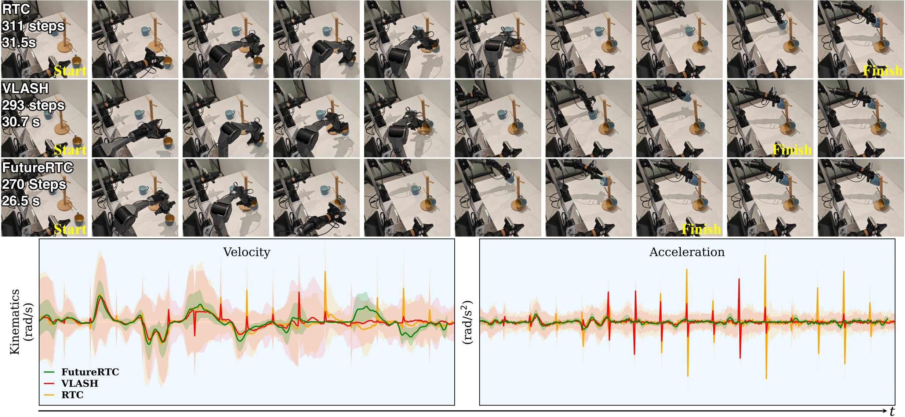

# FutureRTC: Real-Time Robot Execution with Anticipatory-Conditioned Action Chunking
<h4 align="center">Hai Jiang<sup>1</sup>, Yixian Zou<sup>2</sup>, Binbin Liang<sup>1</sup>, Boqian Liu<sup>3</sup>, Fanman Meng<sup>2</sup>, Shuaicheng Liu<sup>2</sup></center>
<h4 align="center">1.Sichuan University,
<h4 align="center">2.University of Electronic Science and Technology of China,</center></center>
<h4 align="center">3.University of Alberta</center></center>
  
<h4 align="center"> <div>
  <p>
    <a href="https://arxiv.org/abs/2607.24008"></a>
    <a href="https://jianghaiscu.github.io/FutureRTC_proj/"></a>
  </p>
  
</div>

---
## Overview

Real-time deployment of Vision-Language-Action (VLA) policies necessitates asynchronous execution, wherein subsequent action chunks are computed concurrently with the execution of the current chunk, leading to prediction-execution misalignment and manifesting as inter-chunk discontinuities. Existing methods either superficially smooth chunk boundaries, require costly policy optimization, or exclusively forward-predict proprioceptive states yet neglect critical visual observations. In this paper, we propose **FutureRTC**, a plug-and-play adaptation framework that predicts execution-time observations and states for asynchronous VLA control without modifying the underlying policy. Specifically, FutureRTC features a state correction module to compensate for the discrepancy between rolled-forward and actual execution-time proprioceptive states and an observation prediction module that forecasts execution-time visual representations by leveraging robot motion as an explicit physical prior through motion-aware feature transport and reconstruction. Furthermore, we introduce a policy consistency loss to align the action chunks generated from predicted contexts with those produced under the expected execution-time inputs of the VLA policy. Extensive experiments across simulated and real-world environments demonstrate that FutureRTC achieves superior robustness to inference delays, resulting in smoother trajectories, faster execution, and consistently higher task success rates. Code will be released to facilitate future research.



---

## Repository structure

The code for each experimental setting lives on its own branch, so that each one can carry the
environment, dependencies and launch scripts it actually needs. Pick the branch matching what you
want to reproduce:

| Branch | Setting | Backbones | Contents |
|---|---|---|---|
| [`sim/libero`](../../tree/sim/libero) | LIBERO simulation | π₀.₅, SmolVLA-450M | Latent-bank collection, state-correction and observation-prediction training, delay-swept evaluation, trained checkpoints |
| [`sim/Kinetix`](../../tree/sim/Kinetix) | Kinetix simulation | Action-chunking flow policies | 12 dynamic environments, delays `d ∈ [0, 4]` |
| [`dev/realworld`](../../tree/dev/realworld) | Real-world bimanual | π₀.₅ | AgileX Cobot Magic deployment: *Stack Plates*, *Fold Towel*, *Hang Cups* |

## Citation

If FutureRTC helps your research, please cite our paper:

```bibtex
@article{jiang2027futurertc,
  title={FutureRTC: Real-Time Robot Execution with Anticipatory-Conditioned Action Chunking},
  author={Jiang, Hai and Zou, Yixian and Liang, Binbin and Liu, Boqian and Meng, Fanman and Liu, Shuaicheng},
  journal={arXiv preprint arXiv:2607.24008},
  year={2026}
}
```

## License

Released under the MIT License (see `LICENSE`). The RTC and Kinetix dependencies carry their own
licenses.
